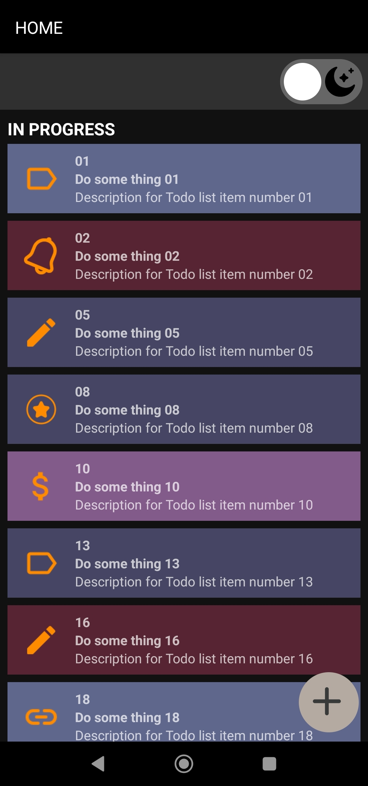
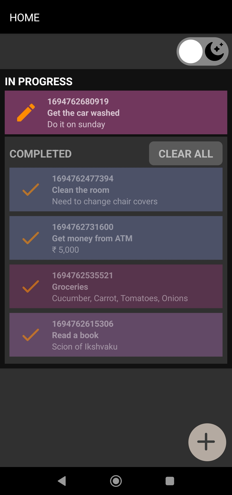

# Todo App by KCN

# Wallpaper App by KCN

### Mockup images

<div style="display: flex;">


</div>

### Features included in this app

- [React Native Navigation](https://wix.github.io/react-native-navigation/) for in-app navigation.
- [React Native Gesture Handler](https://docs.swmansion.com/react-native-gesture-handler/) for swipe animation.
- [AsyncStorage](https://react-native-async-storage.github.io/async-storage/) to store persistent data, in key-value form.
- [React Native Reanimated](https://docs.swmansion.com/react-native-reanimated/) for animations of Bottomsheet.
- [Redux](https://redux.js.org/) with [React Redux](https://react-redux.js.org/) and [Redux Toolkit](https://redux-toolkit.js.org/) for state management.
- Utilizing memoization techniques using [`useCallback`](https://react.dev/reference/react/useCallback), [`useMemo`](https://react.dev/reference/react/useMemo) and [`React.memo`](https://react.dev/reference/react/memo).

### Running the app in debug mode

1. Clone the repo

2. ```sh
   yarn && yarn start
   ```

3. Connect your Android device to your machine and make sure `Developer Options` is enabled.

4. Also make sure you have `adb` installed. See a Youtube video on how to install it, if you don't know how to.

5. In another window of terminal, navigate to the root of the project and run

   ```sh
   cd android && ./gradlew installDebug && cd ..
   ```

6. After the app installs on your phone, run the below command to connect your app running on the phone to debugger on your terminal.

   ```sh
   adb reverse tcp:8081 tcp:8081
   ```

   > NOTE: This must be done each time you physically remove your phone's connection to your machine.

### Screenshots of the app

1. Home page


---

2. On pressing the Floating action Button (FAB) in the bottom, we see this modal entering from bottom.


---

3. Edit and Delete flow in a GIF


---

4. Dark and Light Mode

<div style="display: flex;">

<!-- <div height="400" width="20"></div> -->

</div>

---

5. In progress items


---

6. Partially completed items


